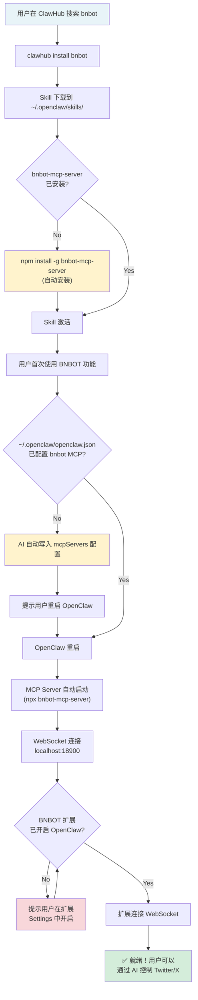
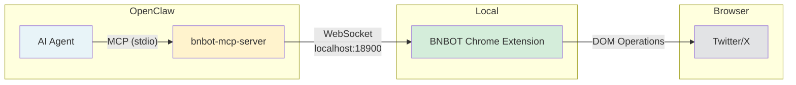

# bnbot-openclaw-skill

OpenClaw Skill for [BNBOT](https://chromewebstore.google.com/detail/bnbot) - Control Twitter/X via AI.

## Install

```bash
clawhub install jackleeio/bnbot-openclaw-skill
```

Or search for "bnbot" on [ClawHub](https://clawhub.ai/).

## User Flow



## Architecture



## What It Does

This skill automatically configures the `bnbot-mcp-server` MCP server and lets your AI assistant:

- Scrape tweets, bookmarks, and search results
- Post tweets and threads
- Reply to tweets
- Navigate Twitter/X pages
- Get account analytics

## Requirements

- [BNBOT Chrome Extension](https://chromewebstore.google.com/detail/bnbot) installed
- OpenClaw toggle enabled in BNBOT Settings
- Twitter/X open in Chrome

## Related

- [bnbot-mcp-server](https://github.com/jackleeio/bnbot-mcp-server) - The MCP server this skill installs
- [BNBOT Extension](https://github.com/jackleeio/BNBOT-Extension) - The Chrome extension
