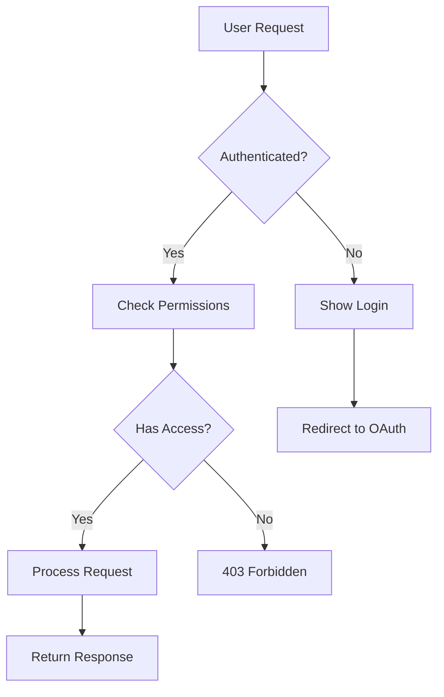
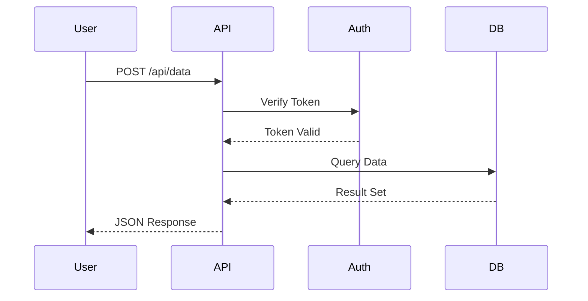
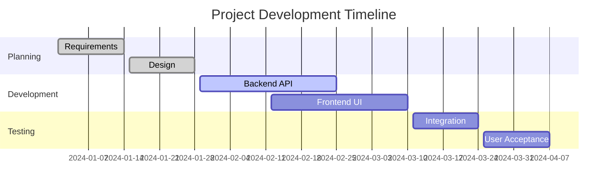
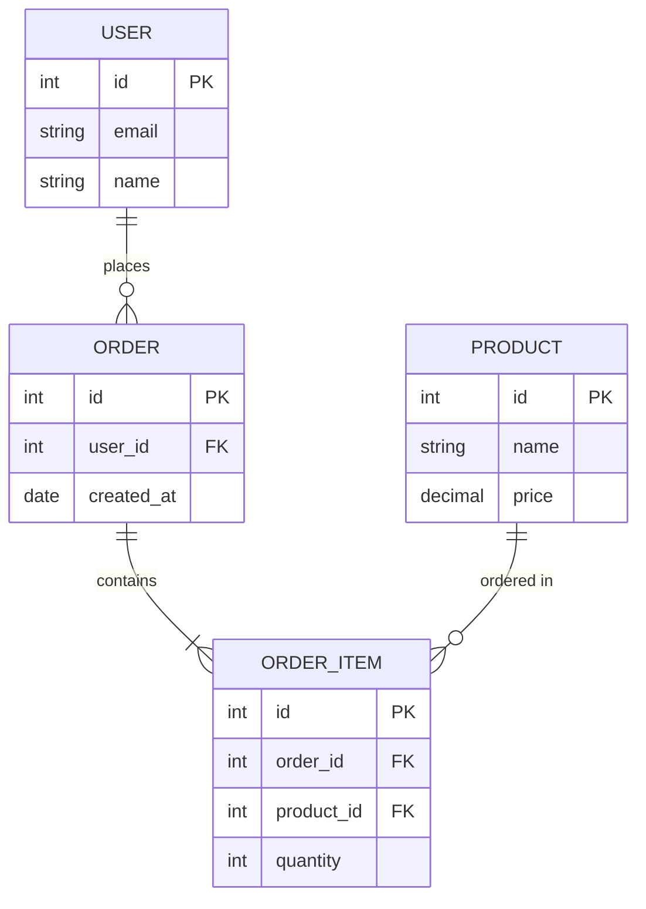

# Mermaid Diagrams Skill

Generate beautiful diagrams from text using [Mermaid](https://mermaid.js.org/). Perfect for flowcharts, sequence diagrams, Gantt charts, and more.

## Quick Start

### Prerequisites

Install the Mermaid CLI globally:

```bash
npm install -g @mermaid-js/mermaid-cli
```

### Installation

```bash
clawhub install mermaid
```

### Usage

The skill uses the `mmdc` command to convert `.mmd` text files into images:

```bash
mmdc -i diagram.mmd -o diagram.png -t dark -b transparent -s 2
```

## Example Diagrams

### 1. Flowchart - Decision Tree



**Use case:** System architecture, decision logic, user flows

### 2. Sequence Diagram - API Interaction



**Use case:** API documentation, debugging async flows, microservice interactions

### 3. Gantt Chart - Project Timeline



**Use case:** Project planning, sprint visualization, milestone tracking

### 4. Entity Relationship Diagram



**Use case:** Database schema design, understanding data relationships

## Common Options

| Flag | Description | Example |
|------|-------------|---------|
| `-i` | Input `.mmd` file | `-i diagram.mmd` |
| `-o` | Output file (PNG/SVG/PDF) | `-o output.png` |
| `-t` | Theme | `-t dark` (default, dark, forest, neutral) |
| `-b` | Background | `-b transparent` |
| `-s` | Scale factor | `-s 2` (for retina displays) |
| `-w` | Width in pixels | `-w 1200` |

## Supported Diagram Types

- **Flowchart** (`graph TD` / `graph LR`) - Process flows, decision trees
- **Sequence** (`sequenceDiagram`) - API calls, async interactions
- **Class** (`classDiagram`) - Object-oriented design
- **State** (`stateDiagram-v2`) - State machines, workflows
- **ER** (`erDiagram`) - Database schemas
- **Gantt** (`gantt`) - Project timelines
- **Pie** (`pie`) - Data visualization
- **Mindmap** (`mindmap`) - Brainstorming, concept maps
- **Git Graph** (`gitGraph`) - Branch visualization
- **Timeline** (`timeline`) - Historical events

## Tips

1. **Use dark theme with transparency** for best results: `-t dark -b transparent`
2. **Scale for retina displays**: `-s 2` or `-s 3` for sharp images
3. **Keep labels concise** - Detail belongs in documentation, not the diagram
4. **Use subgraphs** to group related nodes in flowcharts
5. **Always use `pty: false`** when calling `mmdc` in scripts

## Testing

Run the included test script:

```bash
./generate-test.sh
```

This creates a sample flowchart and verifies the Mermaid CLI is working correctly.

## Documentation

- [Official Mermaid Docs](https://mermaid.js.org/)
- [Live Editor](https://mermaid.live/) - Test diagrams in your browser
- [Syntax Reference](https://mermaid.js.org/intro/syntax-reference.html)

## Troubleshooting

**Issue:** `mmdc: command not found`  
**Solution:** Install globally: `npm install -g @mermaid-js/mermaid-cli`

**Issue:** Diagram renders but text is cut off  
**Solution:** Increase width with `-w 1200` or use `-s 2` for better scaling

**Issue:** Colors look wrong  
**Solution:** Try different themes with `-t` flag or create custom theme config

## License

This skill is a wrapper around the open-source Mermaid project. See [Mermaid's license](https://github.com/mermaid-js/mermaid/blob/develop/LICENSE) for details.
