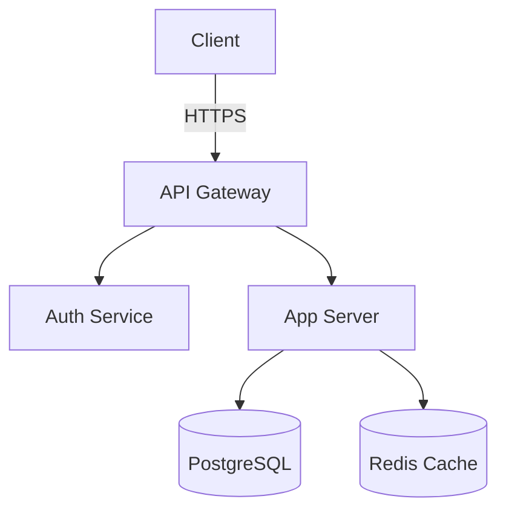
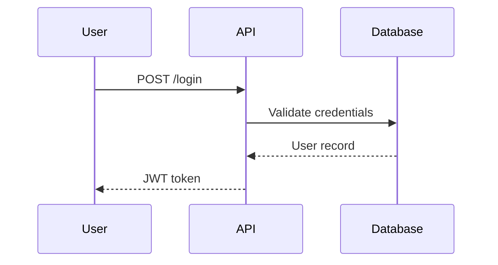

# Mermaid Diagrams Skill

Generate diagrams from text using [Mermaid](https://mermaid.js.org/).

## Requirements

- `@mermaid-js/mermaid-cli` (`npm install -g @mermaid-js/mermaid-cli`)

## Usage

1. Write Mermaid syntax to a `.mmd` file
2. Run `mmdc` to render PNG/SVG
3. Return the image to the user

### Basic Command

```bash
mmdc -i input.mmd -o output.png -t dark -b transparent
```

### Options

| Flag | Description |
|---|---|
| `-i` | Input `.mmd` file |
| `-o` | Output file (`.png`, `.svg`, `.pdf`) |
| `-t` | Theme: `default`, `dark`, `forest`, `neutral` |
| `-b` | Background color (`transparent`, hex) |
| `-w` | Width in pixels (default: 800) |
| `-H` | Height in pixels |
| `-s` | Scale factor (default: 1, use 2-3 for high-res) |
| `-c` | Config JSON file for advanced theming |

### Supported Diagram Types

- **Flowchart**: `graph TD` / `graph LR`
- **Sequence**: `sequenceDiagram`
- **Class**: `classDiagram`
- **State**: `stateDiagram-v2`
- **ER**: `erDiagram`
- **Gantt**: `gantt`
- **Pie**: `pie`
- **Mindmap**: `mindmap`
- **Timeline**: `timeline`
- **Git graph**: `gitGraph`
- **Quadrant**: `quadrantChart`
- **Block**: `block-beta`

### Workflow

1. Determine the best diagram type for what the user wants
2. Write the `.mmd` file to `/tmp/mermaid-<name>.mmd`
3. Render: `mmdc -i /tmp/mermaid-<name>.mmd -o /tmp/mermaid-<name>.png -t dark -b transparent -s 2`
4. Show the image to the user via `Read` tool
5. Clean up temp files if not needed

### Example: Architecture Diagram



### Example: Sequence Diagram



### Tips

- Use `graph LR` for left-to-right flow, `graph TD` for top-down
- Keep node labels short — detail goes in tooltips or notes
- Use subgraphs to group related components
- For dark backgrounds, use `-t dark -b transparent`
- Scale `-s 2` or `-s 3` for sharp images on retina displays
- **Always use `pty: false`** when calling `mmdc`

### Theming

For custom colors, create a config JSON:

```json
{
  "theme": "base",
  "themeVariables": {
    "primaryColor": "#f59e0b",
    "primaryTextColor": "#1a1a1a",
    "primaryBorderColor": "#d97706",
    "lineColor": "#6b7280",
    "secondaryColor": "#10b981",
    "tertiaryColor": "#3b82f6"
  }
}
```

Then: `mmdc -i input.mmd -o output.png -c config.json`
