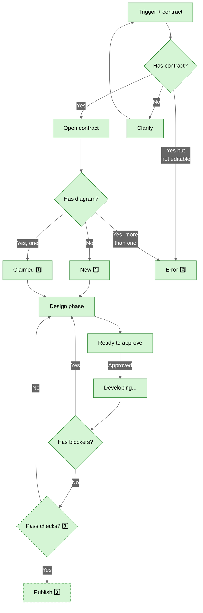

| Legend | Description |
|--------|-------------|
|  | Not discussed yet |
|  | Agreed by stakeholders |
|  | Needs discussion/failed implementation (always has notes) |
|  | Agreed and implemented |
|  | Implemented but developer made decisions (in notes) |
|  | (dashed border) To be performed outside system |

---


## SKILL contract diagram  [ℹ️](https://github.com/nonlinear/skills/tree/main/contract-diagram/SKILL.md)



**1️⃣** Wrapper auto-injects title + phase badge + CSS on first load and watches for change of phase on badge.

**2️⃣** More than one diagram confuses system. For now, only one per md in order to run.

**3️⃣** Checks and publication depend on what and where final product goes, so it's user discretion.

---


## Numbered Notes (1️⃣ 2️⃣ 3️⃣)

**When to use:**

**Pre-execution (design phase):**
- Questions that need discussion
- Trade-offs that need decisions
- Unclear requirements

**During execution:**
- Errors AI can't resolve alone
- Permission needed (destructive action, cost implications)
- Ambiguity in implementation

**Format:**

```markdown
### 1️⃣ [Component Name] - [Issue Title]
**Question/Error:** ...
**Context:** ...
**Options:** A, B, C
**Needed:** Decision / Permission / Help
```

**Notes without numbers = just explanations, turn yellow when approved.**

---

## Localhost Trigger

**Trigger:** "lets diagram [PATH]"

**Assumes:** File at PATH already has mermaid diagram.

**Action:**
1. Start localhost server (port 8080)
2. Open browser with diagram

**Example:**
```
User: "lets diagram epic-notes/webhook-contract.md"

AI executes:
  cd ~/Documents/skills/contract-diagram/engine
  ./serve.sh &
  open "http://localhost:8080/?md=../../epic-notes/webhook-contract.md"
```

**Hot reload enabled by default** (2s interval).

---

