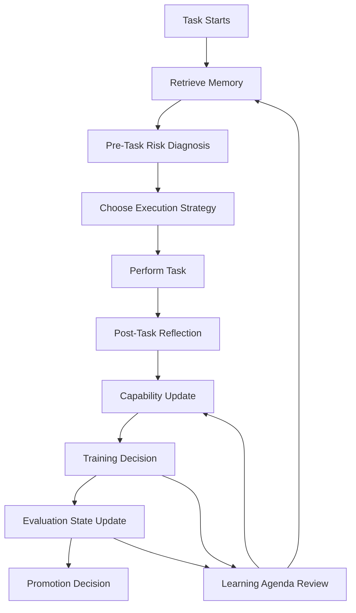

# self-evolving-agent
[](./README.md)
[](./README.zh-CN.md)

[](./SKILL.md)
[](https://github.com/RangeKing/self-evolving-agent/actions/workflows/ci.yml)
[](./LICENSE)
[](https://github.com/RangeKing/self-evolving-agent/stargazers)
[](./benchmarks/suite.json)
[](./system/coordinator.md)

🧠 self-improving-agent only log mistakes.

`self-evolving-agent` is an OpenClaw-first skill that turns passive self-improvement into a full capability evolution loop: diagnose gaps, set learning priorities, generate training units, evaluate progress, verify transfer, and only then promote durable strategies.

It preserves the best parts of [`self-improving-agent`](https://github.com/peterskoett/self-improving-agent), but upgrades the paradigm from:

- incident logging -> capability evolution
- passive memory -> active learning agenda
- correction archive -> curriculum + evaluation + promotion gate

## ✨ Why It Exists

Traditional self-improving agents often stop at:

- "something failed"
- "log the fix"
- "write a rule"

That helps reduce repeated mistakes, but it does not answer the harder questions:

- What can the agent reliably do today?
- Which capability is actually weak?
- What should it practice next?
- Has it truly learned, or only recorded?
- Can the strategy transfer to a different task?

`self-evolving-agent` is built to answer those questions explicitly.

## 📊 self-evolving-agent vs self-improving-agent

| Dimension | `self-improving-agent` | `self-evolving-agent` |
| --- | --- | --- |
| Primary mode | Reactive correction | Goal-driven capability evolution |
| Core unit | Incident, error, note | Capability, training unit, evaluation state |
| Memory model | Learnings and recurring issues | Learnings + capability map + learning agenda |
| Before-task behavior | Review past notes if relevant | Review notes, capability risks, and active training priorities |
| After-task behavior | Log errors and lessons | Diagnose weakest capability, update map, revise agenda, create training if needed |
| Recurrence handling | Detect recurring patterns | Convert recurrence into curriculum with pass criteria |
| Learning states | Mostly implicit | `recorded -> understood -> practiced -> passed -> generalized -> promoted` |
| Promotion rule | Promote useful rules | Promote only validated, transferable strategies |
| Transfer awareness | Limited | Explicit transfer check before promotion |
| What it optimizes for | Fewer repeated mistakes | More independence, stability, transfer, and unfamiliar-task competence |

## 🚀 What Makes This Different

- 🧭 **Learning agenda:** keeps only 1-3 high-leverage capabilities active at a time
- 🗺️ **Capability map:** tracks level, evidence, limits, failure modes, and upgrade conditions
- 🔬 **Diagnosis layer:** turns incidents into capability-level root-cause analysis
- 🏋️ **Curriculum layer:** generates drills, pass criteria, and transfer scenarios
- ✅ **Evaluation ladder:** separates writing something down from actually learning it
- 🔒 **Promotion gate:** prevents brittle one-off rules from polluting long-term behavior
- 🤝 **Memory retention:** still preserves classic logging for errors, learnings, and feature requests

## 🧱 Architecture



## 🔁 Closed Loop

For every meaningful cycle, the skill runs this loop:

1. Classify the task
2. Retrieve relevant learnings and capabilities
3. Run a pre-task risk diagnosis
4. Choose an execution strategy
5. Perform the task
6. Reflect after completion
7. Update the capability map
8. Generate or revise training
9. Evaluate learning progress
10. Promote only validated strategies

Outside the task loop, it also runs a **learning agenda review** when priorities should change.

## 🧩 What It Keeps From self-improving-agent

- Error logging
- Learning capture
- Feature request logging
- Recurring pattern detection
- Review of past learnings before major work
- Promotion into durable workspace context
- Hook-friendly operation

Those strengths remain, but only as the **memory layer**, not the whole system.

## 🎯 Best Fit

Use this skill when you want an agent that should:

- improve across sessions
- become safer on unfamiliar work
- convert repeated failures into deliberate practice
- distinguish recording from mastery
- prove transfer before promotion

## 📁 Repository Layout

```text
self-evolving-agent/
├── SKILL.md
├── README.md
├── README.zh-CN.md
├── install.md
├── agents/
│   └── openai.yaml
├── benchmarks/
│   ├── suite.json
│   └── schemas/
│       └── judge-output.schema.json
├── system/
│   └── coordinator.md
├── modules/
│   ├── capability-map.md
│   ├── curriculum.md
│   ├── diagnose.md
│   ├── evaluator.md
│   ├── learning-agenda.md
│   ├── promotion.md
│   └── reflection.md
├── assets/
│   ├── CAPABILITIES.md
│   ├── ERRORS.md
│   ├── EVALUATIONS.md
│   ├── FEATURE_REQUESTS.md
│   ├── LEARNING_AGENDA.md
│   ├── LEARNINGS.md
│   └── TRAINING_UNITS.md
├── evals/
│   └── evals.json
├── demos/
│   ├── demo-1-diagnosis.md
│   ├── demo-2-training-loop.md
│   ├── demo-3-promotion-and-transfer.md
│   ├── demo-4-agenda-review.md
│   └── demo-5-pre-task-risk-diagnosis.md
├── hooks/
│   └── openclaw/
│       ├── HOOK.md
│       └── handler.ts
└── scripts/
    ├── activator.sh
    ├── bootstrap-workspace.sh
    ├── error-detector.sh
    ├── run-benchmark.py
    └── run-evals.py
```

## ⚡ Quick Start

1. Install the skill into your OpenClaw skills directory.
2. Bootstrap a persistent `.evolution` workspace.
3. Review the learning agenda before difficult tasks.
4. Let the task loop update memory, diagnosis, training, and evaluation artifacts.
5. Run the benchmark suite to see how the skill performs in model-in-the-loop conditions.

```bash
cp -r self-evolving-agent ~/.openclaw/skills/
~/.openclaw/skills/self-evolving-agent/scripts/bootstrap-workspace.sh ~/.openclaw/workspace/.evolution
python3 ~/.openclaw/skills/self-evolving-agent/scripts/run-evals.py ~/.openclaw/skills/self-evolving-agent
python3 ~/.openclaw/skills/self-evolving-agent/scripts/run-benchmark.py --skill-dir ~/.openclaw/skills/self-evolving-agent
```

More setup details are in [install.md](./install.md).

## 🤝 Project Health

- Contribution guide: [CONTRIBUTING.md](./CONTRIBUTING.md)
- Changelog: [CHANGELOG.md](./CHANGELOG.md)
- Security policy: [SECURITY.md](./SECURITY.md)
- License: [MIT](./LICENSE)

## 🧪 Benchmarking

This repository includes two evaluation modes:

- `scripts/run-evals.py`
  - Structural compliance checks for files, modules, and benchmark assets
- `scripts/run-benchmark.py`
  - Real model-in-the-loop execution using `codex exec`
  - Captures candidate prompt, raw events, final output, judge output, and report

Example smoke run:

```bash
python3 scripts/run-benchmark.py \
  --skill-dir . \
  --candidate-model gpt-5.4-mini \
  --judge-model gpt-5.4-mini \
  --max-scenarios 1 \
  --timeout-seconds 90
```

## 🧭 Use Cases

- Upgrading a self-correcting agent into a self-training agent
- Running postmortems that produce training, not just notes
- Building skill memory systems that do not confuse logging with mastery
- Evaluating whether an agent can transfer strategies across task families
- Designing agent curricula for research, coding, verification, or operations workflows

## 🛣️ Roadmap

- [x] Memory, diagnosis, curriculum, evaluator, reflection, promotion modules
- [x] Capability bootstrap map and proactive learning agenda
- [x] Model-in-the-loop benchmark harness
- [ ] More benchmark scenarios for coding, research, and long-horizon execution
- [ ] Optional benchmark trend summaries across repeated runs
- [ ] Example workspace packs for different agent domains

