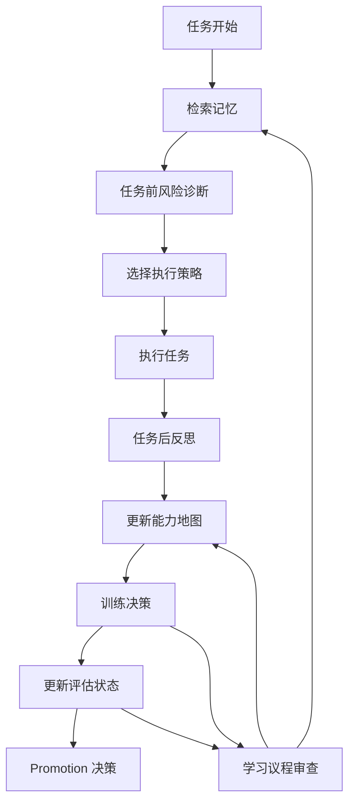

# self-evolving-agent
[](./README.md)
[](./README.zh-CN.md)

[](./SKILL.md)
[](https://github.com/RangeKing/self-evolving-agent/actions/workflows/ci.yml)
[](./LICENSE)
[](https://github.com/RangeKing/self-evolving-agent/stargazers)
[](./benchmarks/suite.json)
[](./system/coordinator.md)

🧠 self-improving-agent 只会记录错误。

`self-evolving-agent` 是一个面向 OpenClaw 的 skill，它把被动式自我改进升级为完整的能力进化闭环：诊断能力缺口、设定学习优先级、生成训练单元、评估进步、验证迁移，最后才把真正有效的策略提升为长期行为。

它保留了 [`self-improving-agent`](https://github.com/peterskoett/self-improving-agent) 的优点，但把范式从下面三件事彻底升级了：

- incident logging -> capability evolution
- passive memory -> active learning agenda
- correction archive -> curriculum + evaluation + promotion gate

## ✨ 为什么存在

传统 self-improving agent 往往停在：

- “出错了”
- “把修正记下来”
- “写成一条规则”

这能减少重复犯错，但回答不了更关键的问题：

- agent 现在到底稳定会什么？
- 真正薄弱的是哪项能力？
- 下一步应该练什么？
- 这条经验只是被记录了，还是已经学会了？
- 这套策略能不能迁移到别的任务？

`self-evolving-agent` 的目标，就是把这些问题显式化。

## 📊 self-evolving-agent vs self-improving-agent

| 维度 | `self-improving-agent` | `self-evolving-agent` |
| --- | --- | --- |
| 主模式 | 被动纠错 | 目标驱动的能力进化 |
| 核心单位 | incident、error、note | capability、training unit、evaluation state |
| 记忆模型 | learnings 与 recurring issues | learnings + capability map + learning agenda |
| 任务前行为 | 如有需要回顾历史笔记 | 回顾历史、能力风险与当前训练重点 |
| 任务后行为 | 记录错误与经验 | 诊断最弱能力、更新能力图谱、刷新 agenda、必要时生成训练 |
| 重复问题处理 | 识别 recurring pattern | 将重复弱点转成带通过条件的训练单元 |
| 学习状态 | 大多隐式 | `recorded -> understood -> practiced -> passed -> generalized -> promoted` |
| promote 规则 | 有价值就 promote | 只有验证通过且可迁移才 promote |
| 迁移意识 | 较弱 | promote 前必须显式检查 transfer |
| 优化目标 | 少重复犯错 | 更独立、更稳定、更可迁移、更擅长陌生任务 |

## 🚀 核心亮点

- 🧭 **Learning agenda：** 同时只保留 1-3 个最高杠杆的训练重点
- 🗺️ **Capability map：** 跟踪等级、证据、边界、失败模式与升级条件
- 🔬 **Diagnosis layer：** 把 incident 提升为能力层根因分析
- 🏋️ **Curriculum layer：** 生成 drills、pass criteria 和 transfer scenarios
- ✅ **Evaluation ladder：** 区分“写下来”和“真正学会了”
- 🔒 **Promotion gate：** 防止一次性经验污染长期策略
- 🤝 **Memory retention：** 保留经典错误、经验、feature request 记录能力

## 🧱 架构总览



## 🔁 学习闭环

每个有意义的 cycle 都运行以下流程：

1. 分类任务（novelty / consequence / horizon）
2. 检索相关 learnings 与 capabilities
3. 执行任务前风险诊断
4. 选择执行策略
5. 执行任务
6. 任务后反思
7. 更新能力地图
8. 生成或修订训练单元
9. 评估学习进度
10. 仅 promote 经过验证的策略

在任务闭环之外，还会在需要时运行 **learning agenda review**，动态调整训练优先级。

## 🧩 它保留了 self-improving-agent 的什么

- 错误记录
- learning capture
- feature request 记录
- recurring pattern 检测
- 重大任务前回顾历史经验
- 向长期上下文 promote
- hook-friendly 的工作方式

这些能力都还在，但它们现在只是 **memory layer**，而不是整个系统。

## 🎯 最适用的场景

如果你希望 agent：

- 能跨 session 持续进化
- 在陌生任务上更稳
- 把重复失败转成刻意训练
- 明确区分“记录”与“掌握”
- 先证明迁移，再沉淀长期策略

那么这个 skill 就是为这种目标设计的。

## 📁 仓库结构

```text
self-evolving-agent/
├── SKILL.md
├── README.md
├── README.zh-CN.md
├── install.md
├── agents/
│   └── openai.yaml
├── benchmarks/
│   ├── suite.json
│   └── schemas/
│       └── judge-output.schema.json
├── system/
│   └── coordinator.md
├── modules/
│   ├── capability-map.md
│   ├── curriculum.md
│   ├── diagnose.md
│   ├── evaluator.md
│   ├── learning-agenda.md
│   ├── promotion.md
│   └── reflection.md
├── assets/
│   ├── CAPABILITIES.md
│   ├── ERRORS.md
│   ├── EVALUATIONS.md
│   ├── FEATURE_REQUESTS.md
│   ├── LEARNING_AGENDA.md
│   ├── LEARNINGS.md
│   └── TRAINING_UNITS.md
├── evals/
│   └── evals.json
├── demos/
│   ├── demo-1-diagnosis.md
│   ├── demo-2-training-loop.md
│   ├── demo-3-promotion-and-transfer.md
│   ├── demo-4-agenda-review.md
│   └── demo-5-pre-task-risk-diagnosis.md
├── hooks/
│   └── openclaw/
│       ├── HOOK.md
│       └── handler.ts
└── scripts/
    ├── activator.sh
    ├── bootstrap-workspace.sh
    ├── error-detector.sh
    ├── run-benchmark.py
    └── run-evals.py
```

## ⚡ 快速开始

1. 把 skill 安装到 OpenClaw skills 目录
2. 初始化持久化 `.evolution` 工作区
3. 复杂任务前先看 learning agenda
4. 让任务闭环自动更新 memory、diagnosis、training、evaluation
5. 跑 benchmark 看这个 skill 在真实模型执行下的表现

```bash
cp -r self-evolving-agent ~/.openclaw/skills/
~/.openclaw/skills/self-evolving-agent/scripts/bootstrap-workspace.sh ~/.openclaw/workspace/.evolution
python3 ~/.openclaw/skills/self-evolving-agent/scripts/run-evals.py ~/.openclaw/skills/self-evolving-agent
python3 ~/.openclaw/skills/self-evolving-agent/scripts/run-benchmark.py --skill-dir ~/.openclaw/skills/self-evolving-agent
```

更完整的安装说明见 [install.md](./install.md)。

## 🤝 项目健康

- 贡献指南：[CONTRIBUTING.md](./CONTRIBUTING.md)
- 变更记录：[CHANGELOG.md](./CHANGELOG.md)
- 安全策略：[SECURITY.md](./SECURITY.md)
- 开源许可证：[MIT](./LICENSE)

## 🧪 Benchmarking

仓库里提供两类评测：

- `scripts/run-evals.py`
  - 结构化合规检查，确保模块、文件与 benchmark 资产完整
- `scripts/run-benchmark.py`
  - 真实 model-in-the-loop benchmark
  - 会保存 candidate prompt、raw events、final output、judge output 和 report

示例 smoke run：

```bash
python3 scripts/run-benchmark.py \
  --skill-dir . \
  --candidate-model gpt-5.4-mini \
  --judge-model gpt-5.4-mini \
  --max-scenarios 1 \
  --timeout-seconds 90
```

## 🧭 用途示例

- 把会自纠错的 agent 升级成会自训练的 agent
- 把 postmortem 从“记笔记”升级成“产出训练”
- 搭建不会把“记录”误当“掌握”的 agent memory system
- 评估 agent 是否真的能跨任务迁移策略
- 为 research、coding、verification、operations 等工作流设计 curriculum

## 🛣️ Roadmap

- [x] Memory / diagnosis / curriculum / evaluator / reflection / promotion 模块
- [x] Capability bootstrap map 与 proactive learning agenda
- [x] Model-in-the-loop benchmark harness
- [ ] 增加更多 coding、research、long-horizon 场景 benchmark
- [ ] 支持多次 benchmark run 的趋势汇总
- [ ] 提供不同 agent 域的 workspace 示例包

