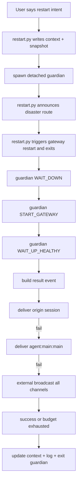

# Restart-Guard Enhanced Restart Implementation Spec (v2.1)

## 1. Document Purpose / 文档目的

This document is a **decision-complete implementation spec** for restart-guard enhanced restart.
It is written so that another AI engineer can reproduce the same behavior and file layout with no extra product decisions.

本文件是 restart-guard 增强重启的**可直接施工规范**。目标是让另一位 AI 工程师无需额外决策即可完整复刻行为与文件落地。

---

## 2. Scope / 范围

Implement and keep synchronized:

1. `scripts/restart.py`
2. `scripts/guardian.py`
3. `scripts/notify.py`
4. `scripts/discover_channels.py`
5. `scripts/write_context.py`
6. `scripts/postcheck.py`
7. `config/restart-guard.yaml.example`
8. `config.example.yaml`
9. `README.md`
10. `SKILL.md`
11. `templates/restart-context.md`
12. `tests/test_guardian_delivery.py`
13. `tests/test_discover_channels.py`
14. Existing tests under `tests/`
15. Mirror directory: `/Users/codez/.openclaw/custom/open-source/restart-guard/*`

Out of scope: OpenClaw core source code changes.

---

## 3. Non-Negotiable Goals / 不可妥协目标

1. User says restart intent only; no manual channel configuration required.
2. Success ACK must return to origin session.
3. Failure path must attempt delivery via:
   - origin session
   - `agent:main:main`
   - all discovered external channels
4. Failure notification must include concise diagnostic summary, not only “failed”.
5. Guardian exits after delivery success or retry-budget exhaustion.
6. Backward compatibility with legacy notification/config fields must be preserved.

---

## 4. Behavior Contracts / 行为契约

## 4.1 User-Facing Contract

When user says phrases like:

- `可以重启了`
- `现在重启吧`
- `restart now`

the skill executes full enhanced restart automatically.

Before restart trigger, the user/origin session receives one short route announcement:

- restart id
- origin session key
- disaster route
- discovered external channels

After restart:

- Success: proactive result in origin session.
- Failure: proactive result with concise diagnostics and local diagnostics file path.

## 4.2 Success Invariant

Success is allowed only when:

`down_detected && start_attempted && up_healthy`

No shortcut based on “health already ok”.

## 4.3 Delivery Policy

Default policy key: `notification.emergency_policy = origin_then_all`

Route order (strict):

1. origin session
2. `agent:main:main`
3. external broadcast (all discovered channels)

Retry policy:

- budget: `guardian.delivery_retry_budget_ms` (default `90000`)
- interval: `guardian.delivery_retry_interval_ms` (default `2000`)

Stop conditions:

- stop immediately after first successful route
- if budget exhausted: mark `delivery_exhausted=true`, log, exit

---

## 5. Data Contracts / 数据契约

## 5.1 Event Contract (`restart_guard.result.v1`)

Required:

- `event_type` = `restart_guard.result.v1`
- `status` = `ok|fail`
- `restart_id`

Optional (must be populated by implementation where applicable):

- `severity` = `info|critical`
- `failure_phase` = `WAIT_DOWN|START_GATEWAY|WAIT_UP_HEALTHY|INVARIANT|""`
- `error_code` (for fail path)
- `delivery_attempts` (int)
- `delivery_route` (`origin_session|main_session|external_broadcast`)
- `delivery_exhausted` (bool)
- `diagnostics_summary`
- `diagnostics_file`
- `context_file`
- `context_snapshot`
- `elapsed_ms`
- `state_timestamps`
- `note`
- `event_time`

## 5.2 Context Frontmatter Contract

Minimum keys:

- `restart_id`
- `origin_session_key`
- `notify_mode`
- `channel_selection`
- `effective_notify_plan`
- `state_timestamps`
- `diagnostics_file`
- `delivery_status`

`delivery_status` values:

- `delivered`
- `delivery_exhausted`
- `""` (not finalized yet)

## 5.3 Diagnostics Artifacts

On failure, write:

- `restart-diagnostics-<restart_id>.json`
- `restart-diagnostics-<restart_id>.md`

Location: same directory as context file.

`diagnostics_summary` in outbound notifications must be concise and redacted.
Full content remains local only.

---

## 6. File-by-File Implementation Blueprint / 逐文件实施蓝图

## 6.1 `scripts/restart.py`

Responsibilities:

1. Parse args, load config, validate preconditions.
2. Resolve origin session key:
   - explicit arg
   - `OPENCLAW_SESSION_KEY` env
   - context frontmatter
   - sessions inference
   - fallback `agent:main:main`
3. Build `effective_notify_plan` via `discover_channels`.
4. Upsert context frontmatter and write restart snapshot.
5. Run precheck `openclaw doctor --non-interactive`.
6. Spawn detached guardian with full context args.
7. Send proactive disaster route announcement to origin session.
8. Trigger restart (HTTP -> signal -> CLI fallback).

Required helper functions:

- `build_effective_notify_plan`
- `discover_notify_channels`
- `announce_disaster_route`
- `send_agent_message`
- `resolve_origin_session_key`
- `select_origin_session_key_from_payload`

Key defaults:

- `notify_mode` default `origin`
- `gateway.restart_delay_ms` default `3000`

## 6.2 `scripts/guardian.py`

Responsibilities:

1. Enforce restart state machine:
   - `WAIT_DOWN`
   - `START_GATEWAY`
   - `WAIT_UP_HEALTHY`
   - `ACK_ORIGIN_SESSION`
2. Record state timestamps and health probes.
3. On failure, build diagnostics bundle and write diagnostics files.
4. Deliver result with retry budget and route fallback.
5. Update context/snapshot with final delivery status.
6. Always release locks and exit.

Required helper functions:

- `deliver_result_with_budget`
- `build_diagnostics_bundle`
- `run_diagnostics_commands`
- `summarize_diagnostics_bundle`
- `write_diagnostics_bundle`
- `redact_sensitive`
- `build_emergency_notification`
- `resolve_external_channels`

Locking:

- global lock: existing lock file
- guardian lock: `<lock>.<restart_id>.guardian.lock`

## 6.3 `scripts/notify.py`

Must expose:

- `notify(...) -> bool` (backward compatible)
- `notify_with_result(...) -> {ok, attempted, succeeded}`

Supported channels:

- `openclaw` tool
- `telegram`
- `discord`
- `slack`
- `webhook`
- passthrough unknown channels (e.g. `feishu`) via openclaw message tool

`webui` must never be treated as a sendable external channel.

## 6.4 `scripts/discover_channels.py`

Discover from both:

- `openclaw.json channels/bindings`
- restart-guard notification config (`channels`, `fallback`, `openclaw.channel`)

Must output:

- `choices`
- `externalChannels` (deduplicated)
- `externalTargets`
- `defaultMode=origin`

## 6.5 `scripts/write_context.py`

Ensure robust YAML/frontmatter parser behavior:

- list/dict/bool/string types remain stable
- preserve unknown keys
- support new keys:
  - `effective_notify_plan`
  - `diagnostics_file`
  - `delivery_status`

## 6.6 `scripts/postcheck.py`

Include in JSON output:

- `restart_id`
- `delivery_status`
- `diagnostics_file`

## 6.7 Config examples

Add defaults:

- `guardian.delivery_retry_budget_ms: 90000`
- `guardian.delivery_retry_interval_ms: 2000`
- `guardian.diagnostics_log_tail: 80`
- `notification.emergency_policy: origin_then_all`

---

## 7. Detailed Flow / 详细流程



Failure phases and error codes mapping:

1. `WAIT_DOWN` -> `WAIT_DOWN_TIMEOUT`
2. `START_GATEWAY` -> `START_GATEWAY_FAILED`
3. `WAIT_UP_HEALTHY` -> `WAIT_UP_TIMEOUT`
4. `INVARIANT` -> `STATE_INVARIANT_FAILED`

---

## 8. Backward Compatibility / 向后兼容

Legacy fields must continue to work:

- `notification.primary`
- `notification.channels`
- `notification.fallback`
- `notification.openclaw.to`

Rules:

1. `notify()` signature unchanged.
2. selected/all/origin modes remain accepted.
3. old configs with missing new keys must run with safe defaults.
4. old `webui=>disable` behavior is deprecated; origin ACK semantics take precedence.

---

## 9. Security and Data Hygiene / 安全与数据卫生

External notifications must not contain raw secrets.

Redaction must cover at least:

- token/api_key/secret/password key-value patterns
- bearer token style headers

Outbound diagnostic content must be summary-only.
Full diagnostics kept in local files.

---

## 10. Test Specification / 测试规范

Run:

```bash
python3 -m unittest discover -s tests -p 'test_*.py'
```

Mandatory test coverage:

1. State invariant logic.
2. `WAIT_DOWN` transition detection.
3. `WAIT_UP_HEALTHY` streak behavior.
4. origin session selection rules.
5. YAML/frontmatter parser stability.
6. delivery route order and fallback.
7. delivery budget exhaustion.
8. diagnostics summary redaction.
9. discover channels dedup + external aggregation.

Expected status: all tests pass.

---

## 11. Acceptance Criteria / 验收标准

A build is accepted only if all are true:

1. User can trigger enhanced restart by natural language intent only.
2. Route announcement is sent before trigger.
3. Success only after `down -> start -> healthy`.
4. Failure notification includes concise diagnostics + local diagnostics file path.
5. Guardian exits after delivered or budget exhausted.
6. Context/log contain `restart_id` and delivery trace.
7. Workspace and open-source mirror have no functional diff (ignore `.git`, `__pycache__`).

---

## 12. Replication Checklist for Another AI / 另一位 AI 的复刻清单

Execute in order:

1. Implement contracts in Sections 4 and 5 first.
2. Implement restart orchestrator (`restart.py`) using Section 6.1.
3. Implement guardian state machine and delivery budget logic (Sections 6.2 and 7).
4. Upgrade notify/discovery/context/postcheck modules.
5. Add/refresh config defaults and docs.
6. Add tests and run full suite.
7. Sync mirror directory.
8. Verify acceptance criteria exactly.

Do not skip steps; each step depends on previous data contracts.

---

## 13. Operational Commands / 运维命令

Quick checks:

```bash
python3 scripts/restart.py --help
python3 scripts/guardian.py --help
python3 scripts/discover_channels.py --config ~/.openclaw/custom/config/restart-guard.yaml --json
python3 scripts/postcheck.py --config ~/.openclaw/custom/config/restart-guard.yaml --json
```

Mirror sync:

```bash
rsync -a --delete --exclude '.git' --exclude '__pycache__' \
  /Users/codez/.openclaw/agents/main/workspace/skills/restart-guard/ \
  /Users/codez/.openclaw/custom/open-source/restart-guard/
```

---

## 14. Change Control / 变更控制

If any of these change, increment spec version and update tests at the same time:

1. Event contract fields.
2. Context frontmatter keys.
3. Delivery route order.
4. Success invariant.
5. Default retry budget or intervals.

No silent behavior drift is allowed.
